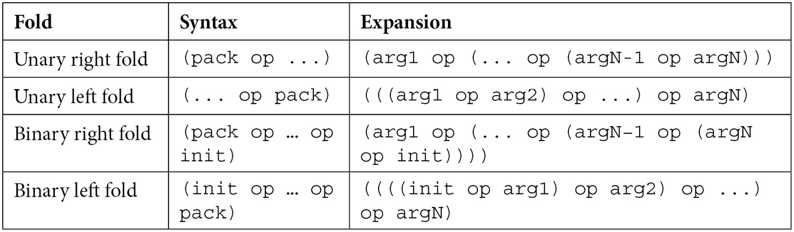

# Fold Expressions
- Fold expression is an expression involving a parameter pack that folds (or reduces) the elements of the parameter pack over a binary operator
### 1. Folding over + operator
```cpp
template<typename... Ts>
auto sum(Ts... args)
{
    // Expands as 
  	// ((arg0 + arg1) + arg2) + arg3
    return (... + args);
}

template<typename... Ts>
auto sum2(Ts... args)
{
  	// Expands as
    // arg0 + (arg1 + (arg2 + arg3))
    return (args + ...);
}

int main()
{
  sum(1, 2, 3, 4);
  sum2(1, 2, 3, 4);
}
```
## Rules for folding

- pack is an expression that contains unexpanded parameter pack which is `args` in above example
- op is one of the following binary operators: +, -, *, /, %, ||, comma operator
- init is an expression that does not contain unexpanded parameter pack
- If parameter pack contains no elements, only a few operations are allowed
### 2. Printing with fold expression
- Note that this is a fold over `,` operator
- `,` has left to right precedence, so print in below example does the same
```cpp
#include<iostream>

template<typename... Ts>
void print(Ts... args)
{
    // Expands to 
    // (std::cout << arg1) , ((std::cout << arg2), ((std::cout << arg3)));
    ((std::cout << args), ...);
}

template<typename... Ts>
void print2(Ts... args)
{
    // Expands to 
    // (((std::cout << arg1), (std::cout << arg2)), (std::cout << arg3));
    (..., (std::cout << args));
}

int main()
{
    print(1, 2, 3); // 123
    print2(1, 2, 3); // 123
}
```
